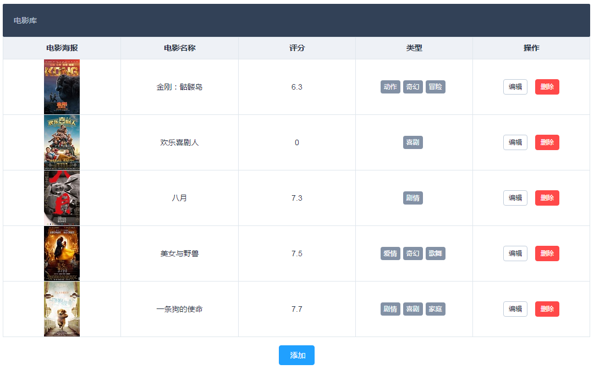
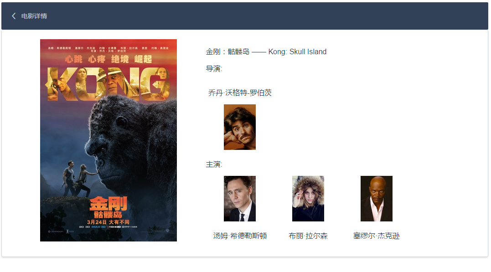

> 项目介绍

* 采用`vue-cli` 构建初始项目目录
* 使用`vue`、`vue-router`、`express`、`webpack`、`gulp`、`Element-ui`构建项目开发环境
* 前端采用Vue、Element-ui搭建页面以及数据处理，后端采用express完成增删改查的restful API
* 页面为电影列表页以及电影详情页

> 目录及文件的改动，均含详细备注

1. config/index.js 中设置了请求端口代理，能够跨域访问服务器端口（8080 => 3000）
2. server  主要是服务端的路由以，api接口，mongodb的配置操作
3. src 为vue应用的主要文件，包含路由，component...
4. gulpfile.js 增加服务器重启和浏览器刷新任务
5. server.js  服务端启动文件


> 操作指令

```shell
npm install 安装依赖

npm run dev 使用webpack开启前端资源的打包编译

npm run data  从豆瓣获取几条源数据

npm run server  启动服务端并开启浏览器

```

这里需要双开两个命令行窗口，一个负责前端的编译，一个负责服务端的任务流

> 环境搭建的详细解决思路

[前端热更新，后端服务重启，浏览器自动刷新]( http://selvinpro.com/2017/03/20/browser-reload/#more)

> 项目一览

* 电影列表页



* 电影详情编辑


* 电影详情页



